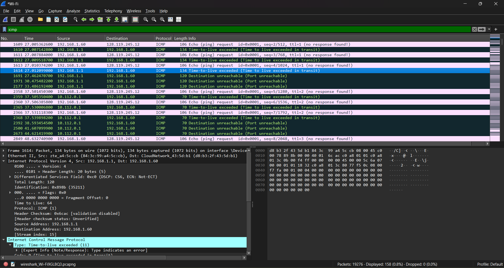
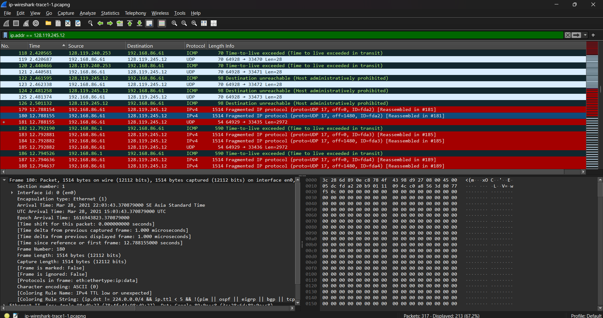
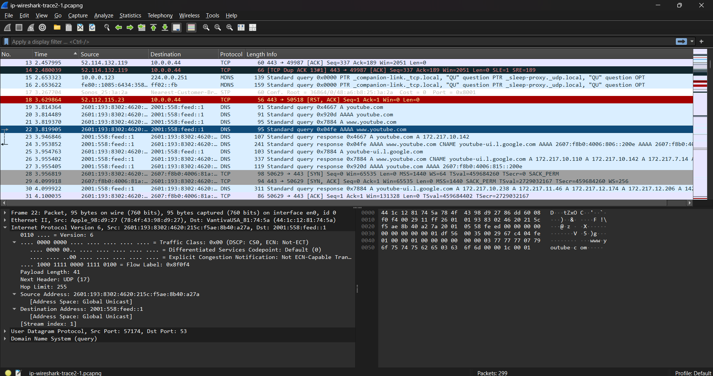

# Laporan Praktikum Jaringan Komputer
## Modul 10: IP (Internet Protocol)

**Nama:** Wirajalu Setyonegoro Wibowo  
**NIM:** 103072400094  
**Kelas:** IF-04-01    

---

#### 10.1 IPv4 Dasar (Traceroute & TTL)
**Tujuan:** Mengmengamati paket IPv4 standar dan mekanisme kerja Time-to-Live (TTL) menggunakan utilitas traceroute/tracert.

**Bukti *Screenshot* Wireshark:**

**Analisis:**
Program traceroute memetakan jalur komunikasi dalam jaringan dengan mengirimkan serangkaian paket data menuju host tujuan secara bertahap sembari menaikkan nilai batas waktu hidup atau *Time-to-Live* (TTL). Setiap kali paket melewati sebuah router (hop), router tersebut berkewajiban mengurangi nilai TTL di dalam header IP sebesar 1. Ketika nilai TTL mencapai angka 0 sebelum paket berhasil sampai ke tujuan akhir, router akan membuang paket tersebut dan mengirimkan sinyal kesalahan berupa pesan *ICMP Time-to-live exceeded* kembali ke host pengirim. Melalui pesan kesalahan inilah host pengirim dapat mencatat dan mengidentifikasi alamat IP dari setiap router perantara yang dilewati sepanjang jalur menuju destinasi.

#### 10.2 Fragmentasi IP
**Tujuan:** Menganalisis perilaku fragmentasi pada protokol IPv4 saat ukuran datagram melebihi batas Maximum Transmission Unit (MTU) yang ditentukan oleh arsitektur jaringan.

**Bukti *Screenshot* Wireshark:**

**Analisis:**
Pada pengiriman pesan atau datagram berukuran besar (3000 byte), paket data tidak dapat ditransmisikan secara utuh karena ukurannya melampaui ambang batas *Maximum Transmission Unit* (MTU) standar fisik jaringan yang umumnya sebesar 1500 byte. Berdasarkan hasil pengamatan Wireshark pada paket nomor 343, router memotong datagram tersebut menjadi beberapa segmen dengan panjang maksimal 1514 byte (termasuk enkapsulasi ethernet frame). Pada bagian detail header Internet Protocol Version 4, flag **More fragments** bernilai **Set (1)**, yang mengindikasikan secara eksplisit bahwa paket ini merupakan potongan awal dan masih memiliki potongan segmen lanjutan di paket berikutnya. Nilai **Fragment Offset** bernilai 0 menandakan byte awal dari kepingan datagram asli. Seluruh kepingan fragmen dari pesan yang sama ditandai dengan nilai **Identification** yang identik (dalam contoh ini `0x0045`), sehingga host tujuan dapat mengenali dan merakit kembali (*reassembly*) seluruh potongan tersebut menjadi satu datagram utuh.

#### 10.3 IPv6
**Tujuan:** Mengamati karakteristik struktur header, format pengalamatan, dan mekanisme resolusi alamat pada Internet Protocol generasi terbaru (IPv6).

**Bukti *Screenshot* Wireshark:**

**Analisis:**
Observasi terhadap datagram IPv6 dilakukan melalui pelacakan paket yang memuat permintaan sistem penamaan domain (DNS) berupa *Standard Query AAAA* untuk domain youtube.com. Query tipe AAAA digunakan secara spesifik untuk memetakan atau mentranslasikan nama domain menjadi alamat IP versi 6, menggantikan query tipe A yang biasa digunakan untuk pemetaan IPv4. Pada panel detail *Internet Protocol Version 6*, terlihat perbedaan fundamental pada format pengalamatan *Source Address* dan *Destination Address* yang tidak lagi menggunakan sistem desimal 32-bit, melainkan mengadopsi sistem blok heksadesimal 128-bit yang jauh lebih panjang. Struktur header IPv6 dirancang lebih ringkas namun menawarkan ruang alokasi alamat global yang jauh lebih masif guna mengantisipasi kelangkaan alamat IP di masa mendatang.

---

### Kesimpulan
Berdasarkan hasil praktikum Modul 10 mengenai investigasi mendalam terhadap protokol IP (IPv4 dan IPv6) menggunakan Wireshark, diperoleh beberapa kesimpulan utama sebagai berikut:

1. **Mekanisme Pelacakan Jalur Traceroute:** Protokol IP memanfaatkan field *Time-to-Live* (TTL) untuk membatasi masa hidup paket di jaringan. Mekanisme penambahan TTL secara bertahap pada traceroute memicu router perantara mengirim balik pesan kesalahan *ICMP Time-to-live exceeded (Type 11)* ketika TTL habis, yang kemudian dimanfaatkan untuk memetakan topologi hop-by-hop menuju host tujuan.
2. **Kondisi Fragmentasi Paket:** Fragmentasi IP merupakan solusi lapisan network ketika ukuran datagram melebihi kapasitas muatan maksimum media transmisi (MTU). Proses pemecahan paket ini sepenuhnya ditangani oleh router perantara sebelum diteruskan ke jalur berikutnya.
3. **Parameter Rekonstruksi Fragmen:** Untuk menyatukan kembali potongan paket di sisi penerima, IPv4 mengandalkan tiga field utama pada headernya: *Identification* (penanda kesamaan datagram induk), *Flags* (khususnya flag *More fragments* untuk mendeteksi akhir potongan), dan *Fragment Offset* (penunjuk urutan byte data).
4. **Arsitektur Pengalamatan IPv6:** IPv6 membawa perubahan struktural besar dengan memperluas ukuran alamat dari 32-bit (IPv4) menjadi 128-bit yang direpresentasikan dalam format heksadesimal, secara efektif menyelesaikan keterbatasan ruang alamat pada IPv4.
5. **Dukungan Infrastruktur DNS IPv6:** Transisi menuju lingkungan IPv6 didukung penuh oleh protokol aplikasi seperti DNS melalui penggunaan record *Query AAAA*, yang secara fungsional setara dengan record A pada IPv4 namun mengembalikan representasi alamat heksadesimal 128-bit.