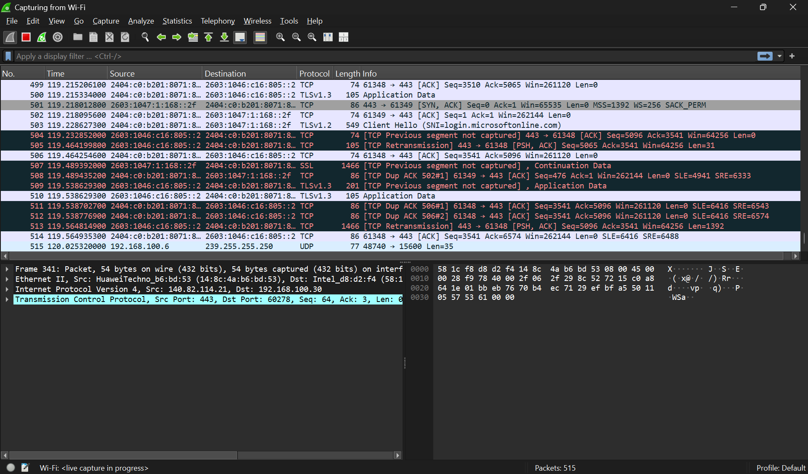
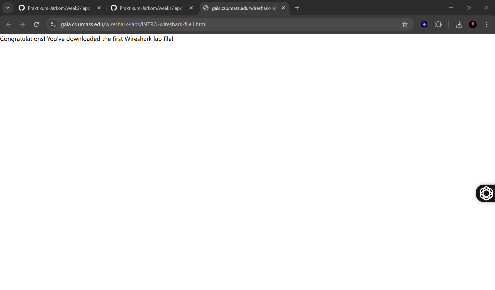

# LAPORAN PRAKTIKUM JARINGAN KOMPUTER - MODUL 1
## Pengenalan Tools

### Identitas Mahasiswa
**Nama:** Wirajalu Setyonegoro Wibowo  
**NIM:** 103072400094  
**Kelas:** IF - 04 - 01

---

## A. Tujuan Praktikum
1. Mahasiswa dapat melakukan instalasi tool yang digunakan (Wireshark).
2. Mahasiswa dapat menggunakan tool (Wireshark) untuk menangkap dan mengidentifikasi paket data.

---

## B. Pengantar
**Wireshark** merupakan aplikasi untuk mengamati pesan yang bertukar antara entitas protokol yang disebut dengan **Packet Sniffer**. Packet Sniffer menangkap (“Sniffs”) pesan yang dikirim/diterima dari/oleh komputer dan biasanya juga akan menyimpan dan/atau menampilkan isi berbagai bidang protokol dalam pesan yang ditangkap. Packet Sniffer bersifat pasif, artinya hanya dapat mengamati pesan yang dikirim/diterima dan tidak pernah mengirim ataupun menerima paket itu sendiri. 

Antarmuka Wireshark memiliki lima komponen utama:
| **No** | **Komponen** | **Deskripsi** |
| :--- | :--- | :--- |
| 1. | Command Menu | Menu pull-down standar yang terletak di bagian atas jendela Wireshark |
| 2. | Packet-Listing Window | Menampilkan ringkasan satu baris untuk setiap paket yang diambil, termasuk nomor paket saat paket ditangkap, sumber paket dan alamat tujuan, jenis protokol, dan informasi khusus protokol yang terkandung dalam paket |
| 3. | Packet-Header Details Window | Memberikan rincian tentang paket yang dipilih (disorot) di jendela daftar paket |
| 4. | Packet-Contents Window |  Menampilkan seluruh isi frame yang diambil, baik dalam format ASCII maupun heksadesimal |
| 5. | Packet Display Filter Field | Kolom input untuk menyaring paket berdasarkan protokol atau kriteria tertentu |

---

## C. Langkah Kerja
1. Pastikan koneksi internet aktif, buka browser, jalankan Wireshark.
2. Capture > Interfaces > Pilih interface aktif > Start. Akan terlihat daftar antarmuka di komputer Anda serta jumlah paket yang telah diamati pada antarmuka itu sejauh ini.
3. Setelah mulai menangkap paket, sebuah jendela akan muncul menunjukkan paket yang ditangkap.  

4. Saat Wireshark sedang berjalan, masukkan URL: http://gaia.cs.umass.edu/wiresharklabs/INTRO-wireshark-file1.html dan tampilkan halaman tersebut di browser.  

5. Setelah browser Anda menampilkan halaman INTRO-wireshark-file1.html, hentikan pengambilan paket Wireshark dengan memilih berhenti di jendela pengambilan Wireshark.
6. Ketik “http” (tanpa tanda kutip, dan dalam huruf kecil) ke kolom spesifikasi filter tampilan di bagian atas halaman utama jendela Wireshark. Ini akan menyebabkan hanya pesan HTTP yang ditampilkan di jendela daftar paket.

7. Temukan pesan HTTP GET yang dikirim dari komputer  ke server HTTP gaia.cs.umass.edu. Cari pesan HTTP GET di bagian "daftar paket yang diambil" dari jendela Wireshark  yang menunjukkan "GET" diikuti oleh URL gaia.cs.umass.edu yang telah dimasukkan.
8. Keluar dari Wireshark