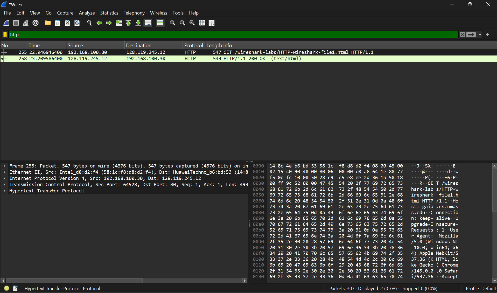
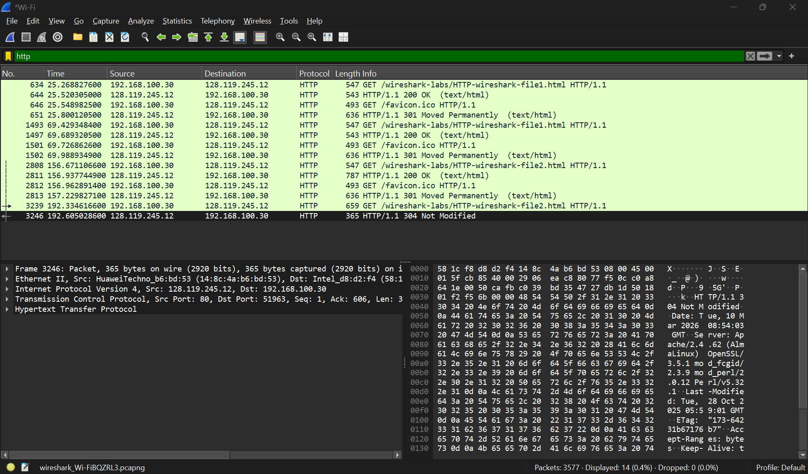
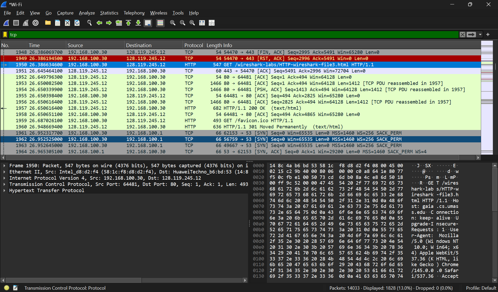
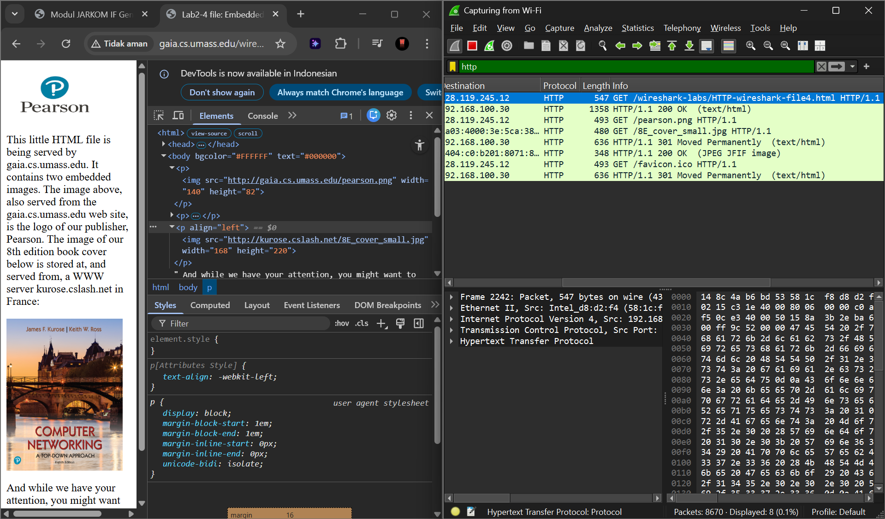
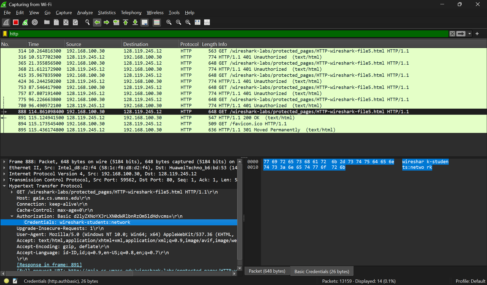

# **LAPORAN PRAKTIKUM JARINGAN KOMPUTER - MODUL 3**
## **HTTP**

### **Identitas Mahasiswa**
**Nama:** Wirajalu Setyonegoro  
**NIM:** 103072400094 
**Kelas:** IF - 04 - 01

---

## A. Tujuan Praktikum
1. Dapat menginvestigasi cara kerja protokol HTTP menggunakan Wireshark.

---

## B. Pengantar
Modul ini membahas beberapa aspek protokol HTTP, seperti : the basic GET/responese interaction (interaksi dasar GET/response), HTTP message formats (format pesan HTTP), retrieving large HTML files (mengambil file HTML besar), retrieving HTML file with embedded objects (mengambil file HTML dengan objek yang disematkan), serta HTTP authentication and security (autentikasi dan keamanan HTTP).

---

## C. Hasil dan Pembahasan
### 1. Basic HTTP GET/response interaction
Langkah-langkah:
- Capture menggunakan Wireshark.
- Akses URL http://gaia.cs.umass.edu/wireshark-labs/HTTP-wireshark-file1.html.
- Stop capture dan filter http.

Output yang diharapkan adalah pesan GET (dari browser ke server web gaia.cs.umass.edu) dan pesan respons (200 OK) dari server ke browser.

### 2. HTTP CONDITIONAL GET/response interaction
Langkah-langkah:
- Hapus cache browser.
- Capture menggunakan Wireshark.
- Akses URL http://gaia.cs.umass.edu/wireshark-labs/HTTP-wireshark-file2.html.
- Masukkan kembali URL yang sama ke browser Anda dengan cepat (atau cukup tekan tombol refresh di browser).
- Stop capture dan filter http.

Output yang diharapkan adalah server merespons 304 Not Modified jika tidak ada perubahan. Pada akses pertama, server mengirim full konten sehingga server merespon OK, tetapi setelah refresh, konten tidak berubah sehingga server merespon Not Modified karena browser memakai cache.

### 3. Retrieving Long Documents
Langkah-langkah:
- Hapus cache browser.
- Capture menggunakan Wireshark.
- Akses URL http://gaia.cs.umass.edu/wireshark-labs/HTTP-wireshark-file3.html.
- Stop capture dan filter http.

Dalam kasus ini, file HTML agak panjang, dan dengan ukuran 4500 byte terlalu besar untuk di muat dalam satu paket TCP. Wireshark menunjukkan setiap segmen TCP sebagai paket terpisah, dan fakta bahwa respons HTTP tunggal terfragmentasi (terbagi) menjadi beberapa paket TCP ditunjukkan oleh “TCP segment of a reassembled PDU” (segmen TCP dari PDU yang dipasang kembali).

### 4. HTML Documents dengan Embedded Objects
Langkah-langkah:
- Hapus cache browser.
- Capture menggunakan Wireshark.
- Akses URL http://gaia.cs.umass.edu/wireshark-labs/HTTP-wireshark-file4.html.
- Browser harus menampilkan file HTML pendek dengan dua gambar. Kedua gambar ini direferensikan dalam file HTML dasar. Artinya, gambar itu sendiri tidak terdapat dalam HTML; alih-alih hanya terdapat URL kedua gambar pada file HTML tersebut. Browser harus mengambil logo ini dari URL situs web yang disematkan pada file HTML. Logo penerbit kita diambil dari situs web gaia.cs.umass.edu.
- Stop capture dan filter http.

### 5. HTTP Authentication
Langkah-langkah:
- Hapus cache browser.
- Capture menggunakan Wireshark.
- Akses URL http://gaia.cs.umass.edu/wireshark-labs/protected_pages/HTTP-wireshark-file5.html. Ketik username dan password yang diminta ke dalam kotak pop up. Username adalah "wiresharkstudents" (tanpa tanda kutip), dan password adalah "network".
- Stop capture dan filter http.

Pada bagian Hypertext Transfer Protocol di Wireshark, username dan password dari user bisa terlihat di bagian Credentials. Pada HTTP, meskipun tampaknya username dan password telah dienkripsi, mereka hanya dikodekan dalam format yang dikenal sebagai format Base64. Hal ini dapat diartikan sebenarnya username dan password tersebut tidak terenkrpisi.

---

## D. Kesimpulan
Berdasarkan praktikum ini, dapat disimpulkan bahwa:
1. Komunikasi HTTP berjalan berdasarkan mekanisme request-response. Klien (browser) meminta data menggunakan pesan HTTP GET, dan server membalasnya dengan status respons (seperti 200 OK berserta konten file jika permintaan berhasil).
2. HTTP memiliki mekanisme caching untuk menghemat bandwidth dan mempercepat waktu muat halaman. Jika klien mengakses halaman yang sama dan file tersebut tidak mengalami perubahan di server, server hanya akan mengirimkan respons 304 Not Modified tanpa mengirim ulang seluruh isi file.
3. File atau dokumen HTML yang berukuran besar (melebihi batas ukuran muatan satu paket TCP) tidak dikirimkan sekaligus. Data tersebut akan difragmentasi menjadi beberapa segmen TCP secara terpisah saat pengiriman, lalu digabung kembali oleh TCP di sisi penerima.
4. Mekanisme keamanan dan autentikasi bawaan dari HTTP tidak aman untuk digunakan pada jaringan publik. Username dan password yang dimasukkan pengguna tidak dienkripsi, melainkan hanya dikodekan menggunakan format Base64.

---