# **LAPORAN PRAKTIKUM JARINGAN KOMPUTER - MODUL 4**
## **Domain Name System (DNS)**

### **Identitas Mahasiswa**
**Nama:** Wirajalu Setyonegoro Wibowo  
**NIM:** 103072400094  
**Kelas:** IF - 04 - 01

---

## A. Tujuan Praktikum
1. Dapat menginvestigasi cara kerja DNS menggunakan Wireshark

---

## B. Pengantar
DNS memegang peranan penting di internet sebagai penerjemah nama host ke alamat IP. Modul ini membahas cara kerja DNS secara khusus di sisi klien. Secara garis besar, tugas klien adalah mengirimkan permintaan ke server DNS lokal dan menerima hasilnya. Klien tidak perlu mengetahui kerumitan yang terjadi di baliknya, yaitu ketika server-server DNS hierarkis saling berkomunikasi secara rekursif atau iteratif untuk meresolusi alamat IP yang diminta.

---

## C. Hasil dan Pembahasan
### 1. Nslookup
Modul ini akan menggunakan perintah nslookup. Untuk menjalankannya di Windows, buka Command Prompt dan ketik nslookup pada baris perintah. Nslookup adalah alat yang memungkinkan sebuah host untuk meminta dan mendapatkan data dari server DNS. Server yang dituju bisa bermacam-macam tingkatan, seperti server DNS root, top-level domain (TLD), otoritatif, atau perantara. Cara kerjanya adalah nslookup mengirimkan permintaan ke server DNS yang diatur oleh host, menunggu balasan dari server bersangkutan, dan langsung menampilkan hasilnya.  

#### a. nslookup www.mit.edu  
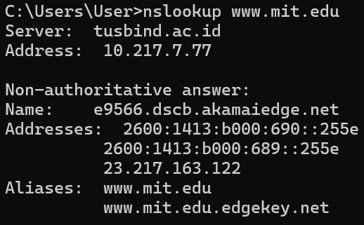  
Jawaban dari perintah ini ada 2, yaitu 
- Nama dan alamat IP server DNS yang memberikan jawaban dari perintah yang dimasukkan
- Jawaban dari perintah tersebut, berupa nama host dan alamat IP www.mit.edu

#### b. nslookup –type=NS mit.edu
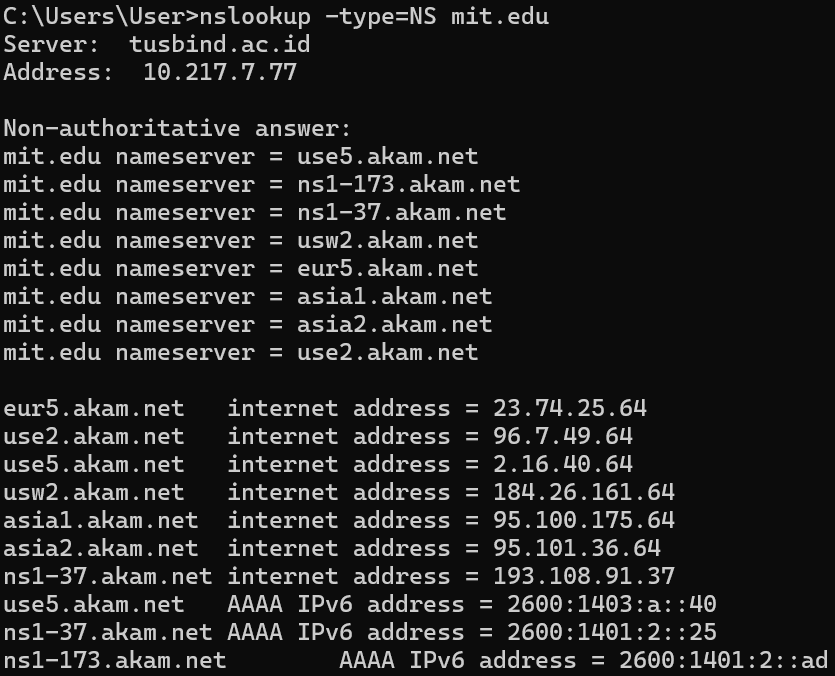  
- Perintah ini meminta server DNS lokal untuk mencari nama host dari server DNS otoritatif milik MIT. 
- Hasil menampilkan server DNS lokal yang menjawab. 
- "Non-authoritative answer" artinya informasi didapatkan dari cache server DNS perantara, bukan langsung dari server MIT. 
- Server lokal juga secara otomatis melampirkan alamat IP dari server-server otoritatif tersebut, meskipun tidak diminta secara eksplisit.

#### c. Query ke DNS Server Tertentu
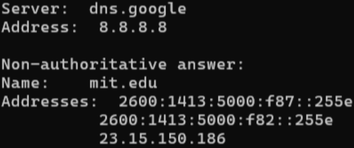  
Eksekusi perintah nslookup www.aiit.or.kr 8.8.8.8 bertujuan untuk melakukan query DNS terhadap domain tertentu dengan menggunakan server DNS spesifik.
- Tujuan: Mencari alamat IP dari hostname "www.aiit.or.kr".
- Spesifikasi Server: Argumen tambahan "8.8.8.8" menginstruksikan nslookup untuk mengirimkan query langsung ke server Google Public DNS, mengabaikan server DNS lokal bawaan (default) yang dikonfigurasi pada host.
- Analisis: Keluaran akan menunjukkan bahwa server 8.8.8.8 merespons permintaan tersebut. Respons yang diberikan berstatus "non-authoritative answer" karena server Google bertindak sebagai resolver perantara dan mengambil informasi dari cache, bukan sebagai server otoritatif dari domain tersebut.

#### d. Query Alamat IP Server Web di Asia
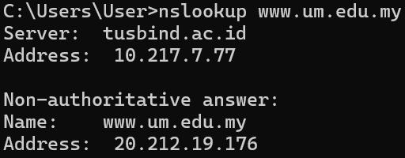  
Analisis:
- Address adalah alamat IP dari server DNS lokal yang menangani permintaan.
- new.snu.ac.kr adalah  nama asli dari server utama yang menaungi situs web tersebut.
- 20.212.19.176 adalah jenis alamat IP untuk domain tersebut.

#### e. Query DNS Otoritatif (NS Record)
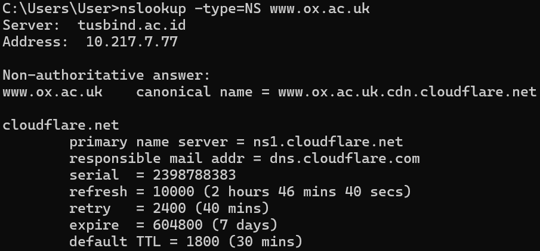  
Analisis:
- Perintah ini meminta server DNS untuk mencari Name Server (NS) records dari domain ox.ac.uk.
- Permintaan ditangani oleh server DNS lokal dengan alamat IP 10.217.7.77.
- Terdapat 6 (enam) server DNS otoritatif (nameserver) yang mengelola domain tersebut, di antaranya auth5.dns.ox.ac.uk hingga auth6.dns.ox.ac.uk.

#### f. Query MX Record (Server Email)
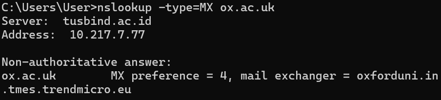  
Analisis:
- Parameter -type=MX menginstruksikan nslookup untuk mencari Mail Exchanger (MX) records. Secara sederhana, query ini bertanya: "Jika ada orang yang mengirim email ke alamat ox.ac.uk, ke server mana email tersebut harus dikirimkan pertama kali?"
- MX preference = 4 merupakan angka  prioritas menentukan urutan prioritas server email.
- Jika ada beberapa MX record, server pengirim email akan mencoba menghubungi server dengan angka preference terkecil terlebih dahulu.

---

### 2. Ipconfig
Perintah ipconfig berfungsi untuk menyajikan detail konfigurasi TCP/IP yang sedang aktif pada sistem, yang mencakup informasi seperti alamat IP, alamat server DNS, identifikasi jenis adaptor jaringan, serta parameter terkait lainnya.

#### a. ipconfig /all
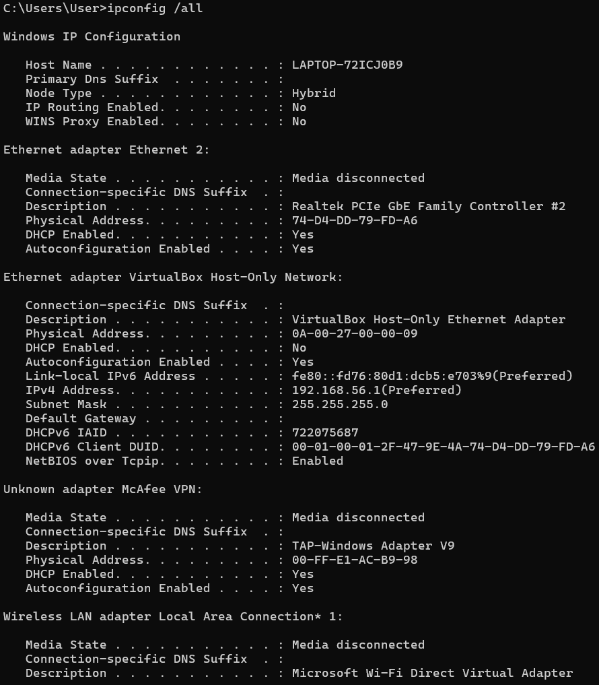
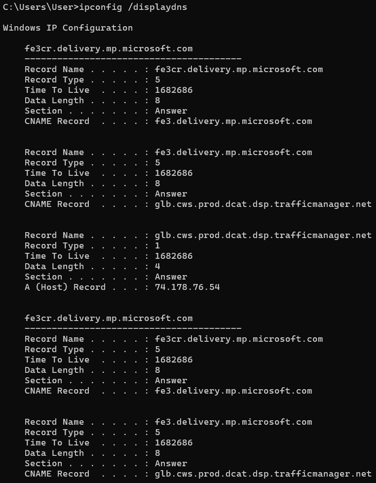  
- Dengan ipconfig /all dapat memperoleh semua informasi tentang host.
- IPv4 Address: Alamat laptop di jaringan lokal.
- Subnet Mask: Menentukan rentang jaringan.
- Default Gateway: Alamat router / modem.
- DNS Servers: Server yang dipakai untuk resolusi DNS.
- Physical Address: MAC Address adapter jaringan.

#### b. ipconfig /displaydns
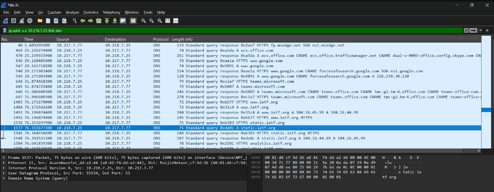
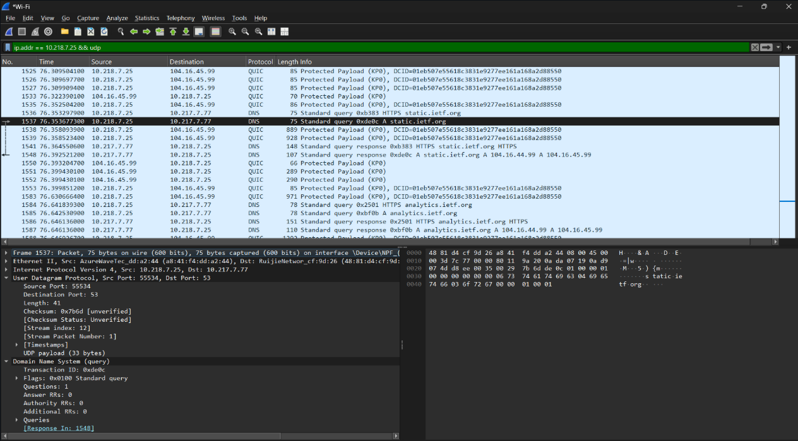  
- Perintah ini berguna untuk melihat record yang telah disimpan.
- Hasil yang didapatkan akan menampilkan record dan sisa Time To Live (TTL) dalam satuan detik.

---

### 3. Tracing DNS dengan Wireshark
#### a. Tracing DNS Tanpa nslookup
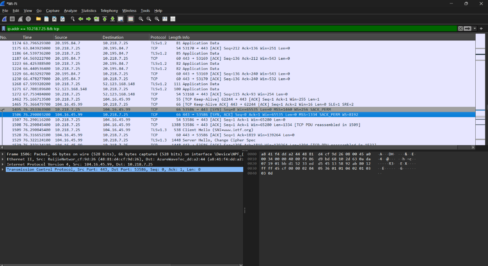
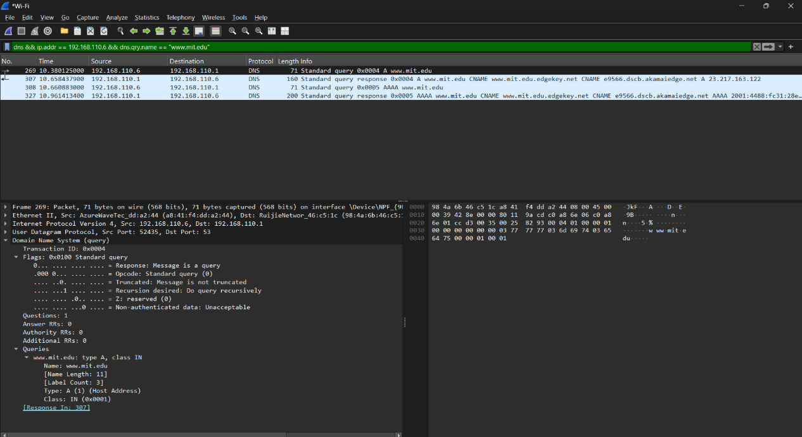
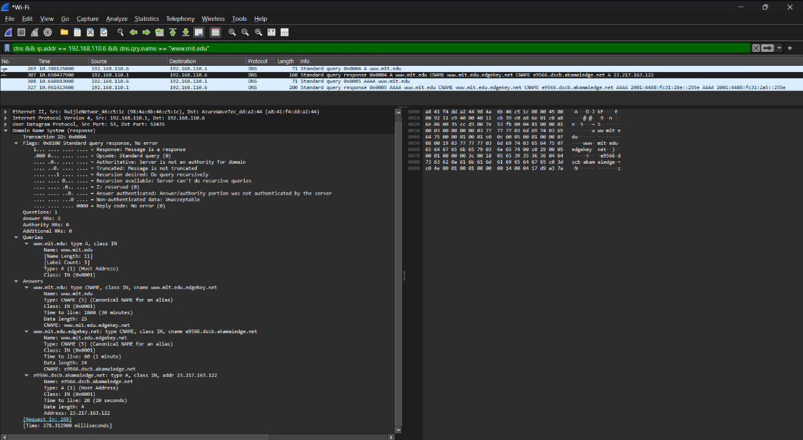

**Pertanyaan dan Jawaban**  
1. Apakah pesan tersebut dikirimkan melalui UDP atau TCP?
> Pesan permintaan dan balasan DNS tersebut dikirimkan melalui protokol UDP.

2. Apa port tujuan pada pesan permintaan DNS? Apa port sumber pada pesan balasannya?
> - Port tujuan (Destination Port) pada pesan permintaan DNS (Frame 1537) adalah 53 (port standar untuk DNS).
> - Port sumber (Source Port) pada pesan balasan (Frame 1548) juga adalah 53. Port tujuan dari sebuah query akan menjadi port sumber saat server memberikan balasan.

3. Pada pesan permintaan DNS, apa alamat IP tujuannya? Apa alamat IP server DNS lokal anda? Apakah kedua alamat IP tersebut sama?
> - Alamat IP tujuan pada permintaan DNS (Frame 1537) adalah 10.217.7.77.
> - Alamat IP server DNS lokal kamu adalah 10.217.7.77.
> - Ya, kedua alamat IP tersebut sama. Komputer (IP 10.218.7.25) mengirimkan permintaan DNS langsung ke server DNS lokal (10.217.7.77) yang sudah terkonfigurasi di jaringan untuk meminta resolusi nama domain.

4. Apa "jenis" atau "type" dari pesan tersebut? Apakah pesan permintaan tersebut mengandung "jawaban" atau "answers"?
> - Jenis (type) dari pesan permintaan tersebut adalah Tipe A (mencari alamat IPv4). Hal ini terlihat di kolom Info ("Standard query 0xde0c **A** static.ietf.org").
> - Pesan permintaan tidak mengandung jawaban.

5. Berapa banyak "jawaban" atau "answers" yang terdapat di dalamnya? Apa saja isi yang terkandung dalam setiap jawaban tersebut?
> terdapat 2 jawaban (answers). Isi dari jawaban tersebut adalah pemetaan ke alamat IPv4, yaitu: 104.16.44.99 dan 104.16.45.99.

6. Apakah alamat IP pada paket TCP SYN sesuai dengan alamat IP yang tertera pada pesan balasan DNS?
> Ya, alamat IP pada paket TCP SYN sesuai dengan alamat IP yang tertera pada pesan balasan DNS.

7. Apakah host Anda perlu mengirimkan pesan permintaan DNS baru setiap kali ingin mengakses suatu gambar?
> Tidak selalu. Host tidak perlu mengirimkan permintaan DNS baru jika gambar berada di domain yang sama karena alamat IP-nya akan disimpan dalam cache DNS lokal komputer untuk beberapa waktu (Time To Live / TTL).

#### b. Tracing DNS dengan nslookup
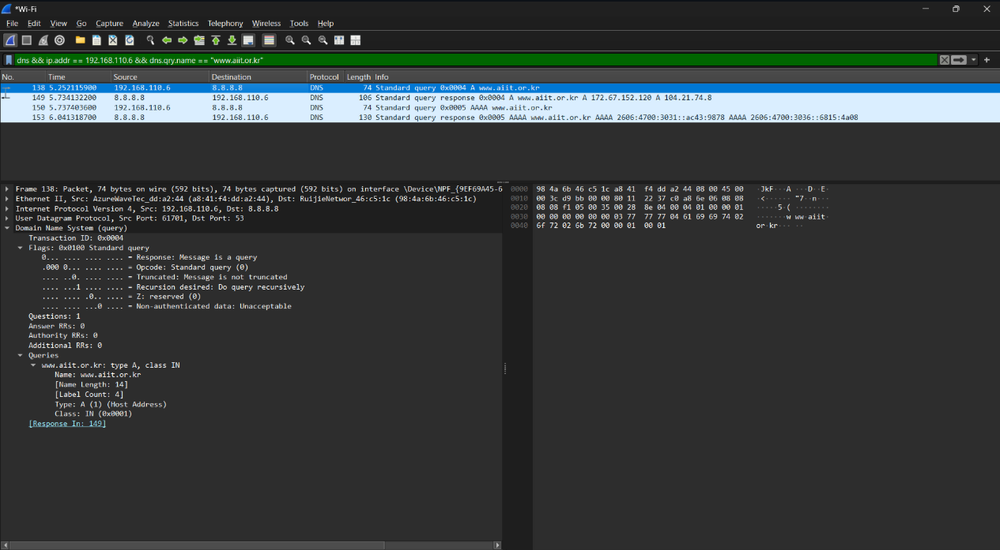
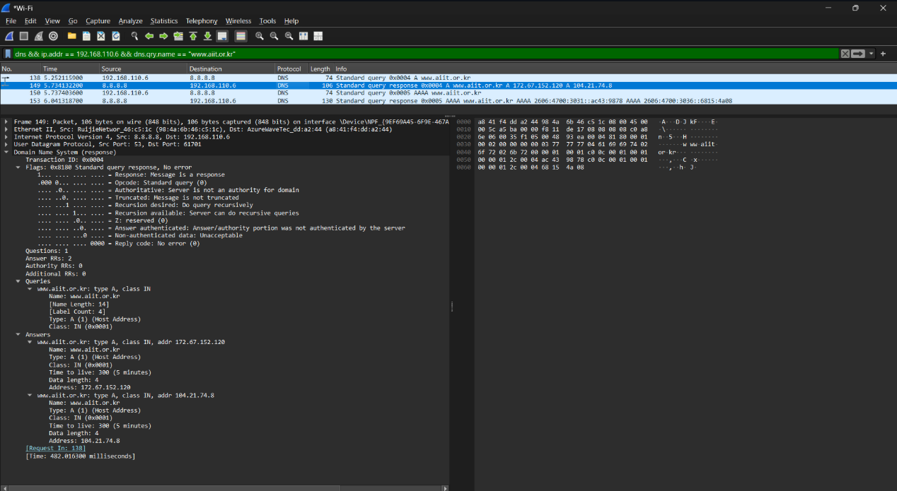  

**Pertanyaan dan Jawaban**  
1. Apa port tujuan pada pesan permintaan DNS? Apa port sumber pada pesan balasan DNS?
> - Port tujuan pada pesan permintaan DNS (Frame 269) adalah 53. Bisa dilihat pada bagian User Datagram Protocol baris Dst Port: 53.
> - Port sumber pada pesan balasan DNS (Frame 307) juga adalah 53. Bisa dilihat pada bagian User Datagram Protocol baris Src Port: 53.

2. Ke alamat IP manakah pesan permintaan DNS dikirimkan? Apakah alamat IP tersebut merupakan default alamat IP server DNS lokal Anda?
> Pesan permintaan DNS dikirimkan ke alamat IP tujuan 192.168.110.1 yang juga merupakan default server DNS lokal.

3. Periksa pesan permintaan DNS. Apa "jenis" atau "type" dari pesan tersebut? Apakah pesan tersebut mengandung "jawaban" atau "answers"?
> - Jenis atau type dari pesan permintaan tersebut adalah Type A (Host Address).
> - Pesan permintaan tersebut tidak mengandung "jawaban".

4. Periksa pesan balasan DNS. Berapa banyak "jawaban" atau "answers" yang terdapat di dalamnya? Apa saja isi yang terkandung dalam setiap jawaban tersebut?
> Terdapat 3 "jawaban" (Answer RRs: 3) di dalam pesan balasan DNS tersebut (Frame 307). Isi dari ketiga jawaban tersebut secara berurutan adalah:
> - Jawaban 1 (CNAME): Menyatakan bahwa www.mit.edu adalah sebuah alias (Canonical Name) yang merujuk ke nama www.mit.edu.edgekey.net.
> - Jawaban 2 (CNAME): Menyatakan bahwa www.mit.edu.edgekey.net juga merupakan sebuah alias yang merujuk lebih lanjut ke nama e9566.dscb.akamaiedge.net.
> - Jawaban 3 (Type A): Memberikan alamat IPv4 asli untuk host terakhir tersebut, yaitu alamat IP 23.217.163.122.

### c. Query ke DNS Server Spesifik
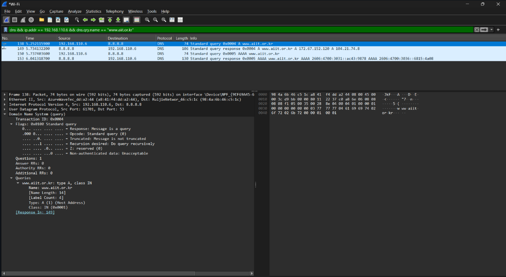
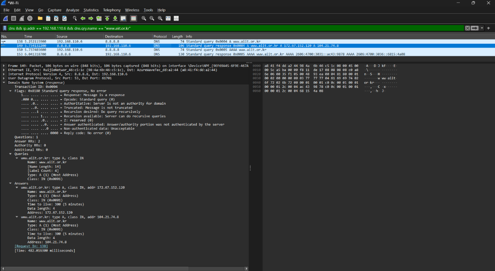  

**Pertanyaan dan Jawaban**
1. Ke alamat IP manakah pesan permintaan DNS dikirimkan? Apakah alamat IP tersebut merupakan default alamat IP server DNS lokal Anda?
> - Pesan permintaan DNS dikirimkan ke alamat IP tujuan 8.8.8.8.
> - IP 8.8.8.8 bukan defaul alamt Ip melainkan  alamat dari server Google Public DNS. Skenario ini terjadi karena perintah yang dieksekusi secara spesifik memaksa query DNS untuk dikirim langsung ke server Google (perintah nslookup www.aiit.or.kr 8.8.8.8).

2. Periksa pesan permintaan DNS. Apa "jenis" atau "type" dari pesan tersebut? Apakah pesan tersebut mengandung "jawaban" atau "answers"?
> - Jenis dari pesan tersebut adalah Type A (Host Address).
> - Pesan permintaan tersebut tidak mengandung "jawaban".

3. Periksa pesan balasan DNS. Berapa banyak "jawaban" atau "answers" yang terdapat di dalamnya? Apa saja isi yang terkandung dalam setiap jawaban tersebut?
> Terdapat 2 jawaban di dalam pesan balasan DNS tersebut (Frame 149). Isi dari kedua jawaban tersebut adalah:
> - Jawaban pertama berisi alamat IP 172.67.152.120.
> - Jawaban kedua berisi alamat IP 104.21.74.8.

---

## D. Kesimpulan
Modul ini menjelaskan tetang Domain Name System (DNS) sebagai penerjemah nama domain menjadi alamat IP. Melalui perintah nslookup, klien dapat melakukan query spesifik terhadap berbagai record DNS (seperti tipe A, NS, dan MX), sementara ipconfig berfungsi untuk memantau konfigurasi dan mengelola cache DNS lokal. Analisis menggunakan Wireshark memvisualisasikan bagaimana komunikasi DNS beroperasi di latar belakang melalui protokol UDP, mulai dari pengiriman query hingga pemrosesan record alias (CNAME).

---